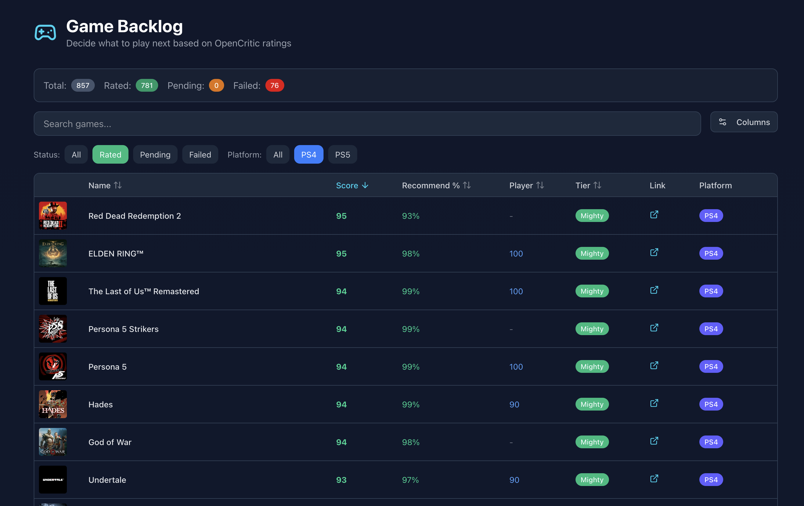

# PlayStation Game Backlog Manager

A tool to organize and prioritize your PlayStation game library based on OpenCritic ratings. Import your PS4/PS5 games from your PlayStation account and see which games are worth playing first.



## Features

- **Import PlayStation Library** - Automatically fetch all your purchased PS4 and PS5 games
- **OpenCritic Ratings** - Scrape game ratings, review scores, and tier rankings
- **Sortable Data Table** - Filter and sort games by score, tier, platform, and status
- **Persistent Preferences** - Column visibility, ordering, and filters saved to localStorage
- **Platform Filtering** - View PS4, PS5, or all games

## Prerequisites

- [Bun](https://bun.sh/) runtime
- A PlayStation Network account
- Your PSN NPSSO token (authentication cookie)

## Setup

### 1. Install Dependencies

```bash
bun install
```

### 2. Configure Environment Variables

Create a `.env` file in the project root:

```env
DATABASE_URL=./data.db
NPSSO=your_npsso_token_here
```

#### Getting Your NPSSO Token

1. Log into the [PlayStation Store](https://store.playstation.com/) in your browser
2. Open a new tab and visit: `https://ca.account.sony.com/api/v1/ssocookie`
3. Copy the `npsso` value from the JSON response
4. Paste it into your `.env` file

> **Note:** The NPSSO token expires after a few months. You'll need to repeat this process when it expires.

### 3. Initialize Database

```bash
bun run db:push
```

## Usage

### Step 1: Import Your Game Library

Fetch all your purchased games from PlayStation Network:

```bash
bun run src/modules/ps-app/load_data.ts
```

This will import all your PS4 and PS5 games into the local database.

### Step 2: Scrape OpenCritic Ratings

Fetch ratings for your games from OpenCritic:

```bash
bun run src/modules/ps-app/load_scores.ts
```

This script:
- Opens multiple browser windows to speed up scraping
- Searches for each game on OpenCritic
- Saves the critic score, recommendation percentage, player rating, and tier
- Records failed scrapes so they won't be retried

> **Note:** The script may need to be run multiple times if you have a large library, as some searches may fail due to naming differences or network issues.

### Step 3: View Your Backlog

Start the web interface:

```bash
bun run dev
```

Open [http://localhost:3000](http://localhost:3000) to view your game backlog with ratings.

## Web Interface Features

- **Search** - Filter games by name
- **Status Filter** - View all, rated, pending, or failed games
- **Platform Filter** - Filter by PS4 or PS5
- **Sortable Columns** - Click column headers to sort by score, tier, name, etc.
- **Column Settings** - Hide/show and reorder columns
- **Pagination** - Choose how many games to display per page

## Rating Tiers

OpenCritic uses the following tier system:

| Tier | Description |
|------|-------------|
| **Mighty** | Exceptional (90+) |
| **Strong** | Great (75-89) |
| **Fair** | Average (60-74) |
| **Weak** | Below Average (40-59) |
| **Poor** | Bad (<40) |

## Database Schema

The project uses SQLite with Drizzle ORM:

- `purchased_games` - Your PlayStation library
- `game_ratings` - OpenCritic scores and tiers
- `failed_scrapes` - Games that couldn't be found on OpenCritic

## Scripts

| Command | Description |
|---------|-------------|
| `bun run dev` | Start development server |
| `bun run build` | Build for production |
| `bun run db:studio` | Open Drizzle Studio to browse database |
| `bun run db:push` | Push schema changes to database |

## Tech Stack

- **Runtime:** Bun
- **Framework:** TanStack Start (React)
- **Database:** SQLite + Drizzle ORM
- **Styling:** Tailwind CSS + shadcn/ui
- **Scraping:** Puppeteer
- **PSN API:** psn-api

## Troubleshooting

### NPSSO Token Expired
If `load_data.ts` fails with authentication errors, your NPSSO token has expired. Get a new one following the setup instructions above.

### Games Not Found on OpenCritic
Some games may not be found due to:
- Different naming conventions (e.g., "FFVII" vs "Final Fantasy VII")
- DLC or special editions not having separate listings
- Regional naming differences

Failed games are recorded in the `failed_scrapes` table and won't be retried automatically.

### Scraping Timeouts
If `load_scores.ts` times out frequently:
- Reduce `NUM_TABS` in the script (default: 4)
- Check your internet connection
- Run the script again - it will skip already-rated games

### Retrying Failed Games

Games that fail to scrape are stored in the `failed_scrapes` table and won't be retried automatically. To retry them:

1. Open Drizzle Studio:
   ```bash
   bun run db:studio
   ```

2. Navigate to the `failed_scrapes` table

3. Delete the rows for games you want to retry (select rows and delete, or run SQL):
   ```sql
   -- Delete specific game
   DELETE FROM failed_scrapes WHERE game_name LIKE '%Game Name%';

   -- Delete all failed scrapes to retry everything
   DELETE FROM failed_scrapes;
   ```

4. Run the scraper again:
   ```bash
   bun run src/modules/ps-app/load_scores.ts
   ```

The script will now attempt to fetch ratings for those games again.

## License

MIT
